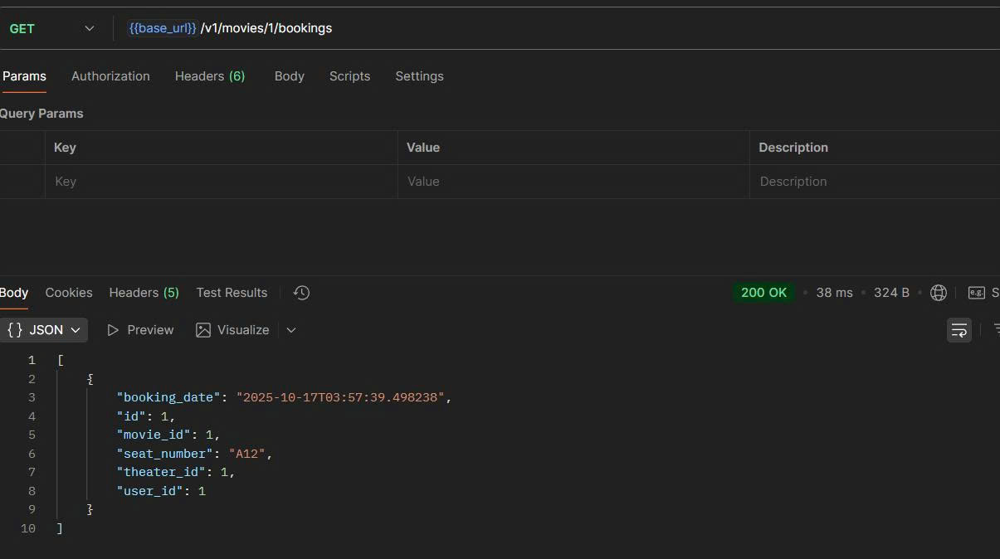
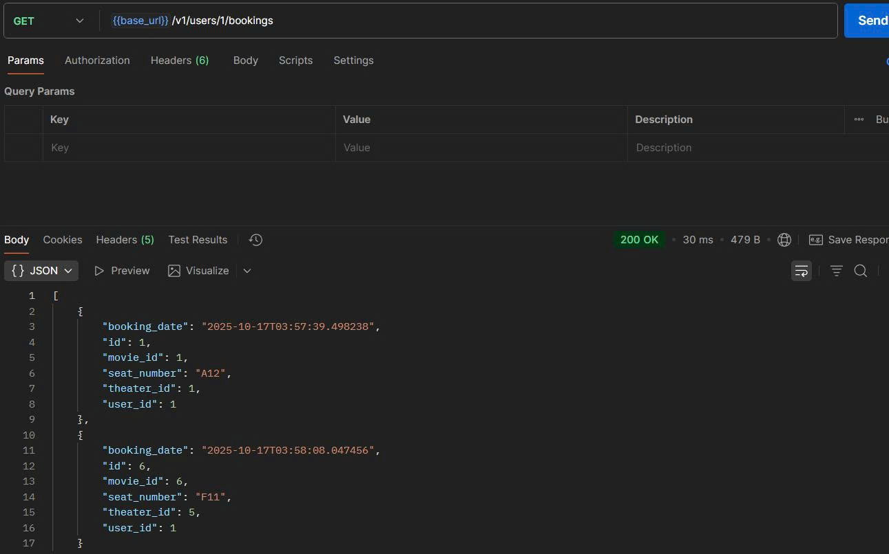
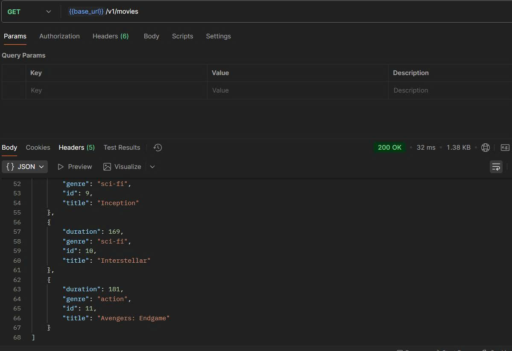
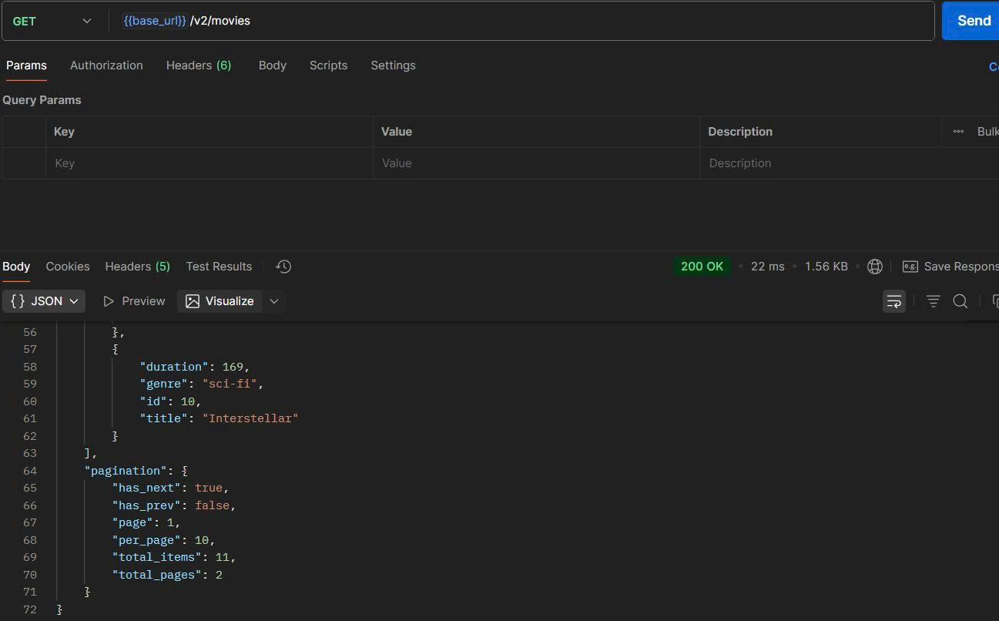
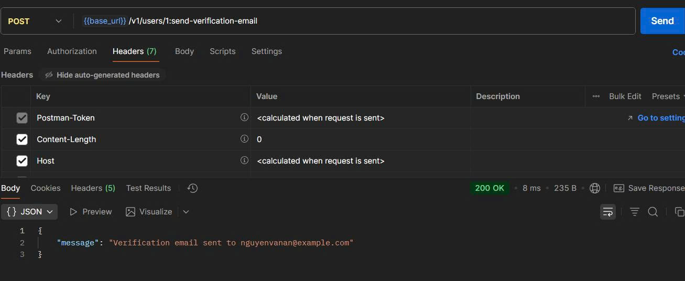
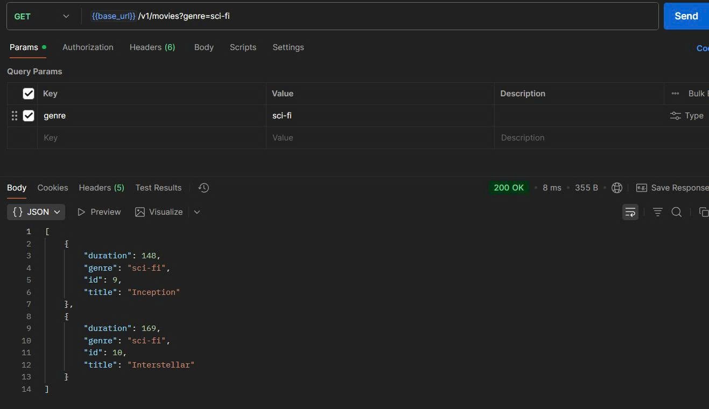
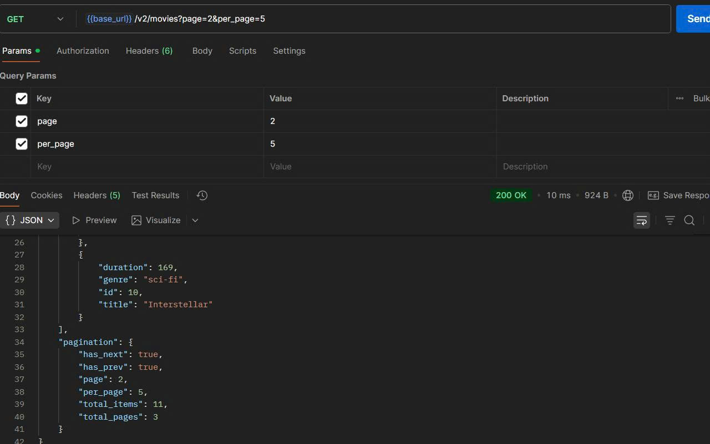

# Demo Lesson 4 - Nguyên tắc thiết Kế API

## Tổng quan
Demo hệ thống đặt vé xem phim theo các nguyên tắc thiết kế RESTful API. Project có 2 version API (v1 và v2) để thể hiện tính mở rộng.

## Naming Convention

###  Dùng danh từ, không dùng động từ

GET    /v1/users
POST   /v1/movies
DELETE /v1/theaters/1  

###  Sử dụng danh từ số nhiều

#### Lấy danh sách users
GET /v1/users
#### Lấy user id=5 từ collection users
GET /v1/users/5
#### Lấy danh sách movies
GET /v1/movies  
#### Lấy movie id=123 từ collection movies
GET /v1/movies/1

### URL lồng nhau cho quan hệ cha-con

#### Lấy bookings của user 5
GET /v1/users/5/bookings
#### Lấy bookings của movie 3
GET /v1/movies/3/bookings

### API Versioning

#### Version 1 - không có pagination
GET /v1/movies
#### Version 2 - có pagination
GET /v2/movies

### Custom Methods với :verb
**Send verification email:**

## Tính mở rộng

### Query Parameters cho filtering, search

#### Tất cả phim
GET /v1/movies
#### Tìm kiếm theo tên
GET /v1/movies?search=inception 
#### Lọc theo thể loại
GET /v1/movies?genre=sci-fi

### Pagination

GET /v2/movies?page=2&per_page=5

